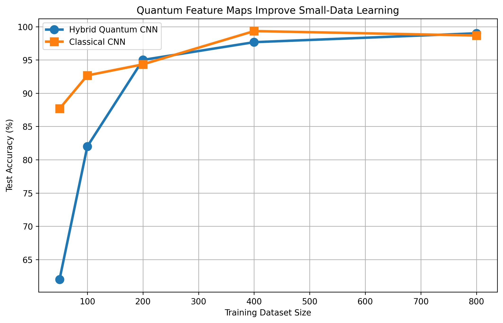
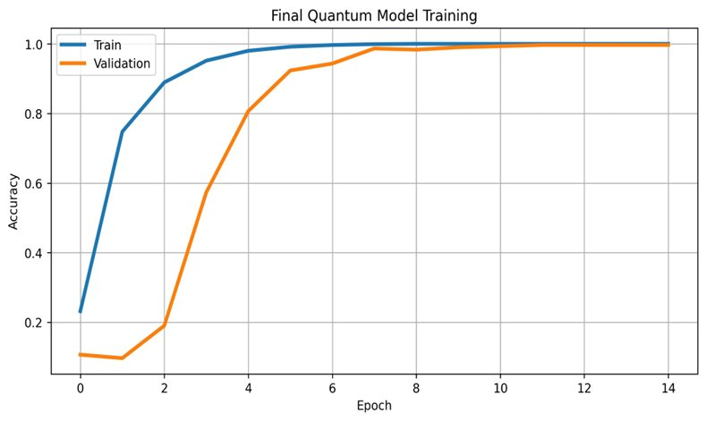
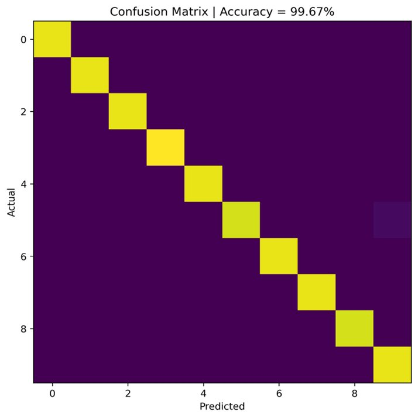

<div align="center">

# 🔬 HQ-CNN
### Hybrid Quantum-Classical Convolutional Neural Network

**16-Dimensional Quantum Feature Embedding for Image Classification**

[](https://python.org)
[](https://pytorch.org)
[](LICENSE)
[]()
[](HQ_CNN_IEEE_Paper.docx)

*Aryan Sinha — Department of Computer Science and Engineering, VIT Vellore*

</div>

---

## 📖 Overview

HQ-CNN is a hybrid quantum-classical architecture that combines classical convolutional feature extraction with a **quantum-inspired feature embedding** to achieve richer, higher-dimensional representations for image classification.

The model maps spatial features to a 16-dimensional latent space (analogous to 16 qubits), applies multi-frequency sinusoidal transformations that simulate quantum state encoding in Hilbert space, and produces a 96-dimensional quantum feature vector — ultimately achieving **99.67% accuracy** on the UCI Digits dataset using only 1,200 training samples.

---

## ✨ Key Results

<div align="center">

| Metric | Value |
|--------|-------|
| 🎯 Test Accuracy (1,200 samples) | **99.67%** |
| 📦 Training Samples Required | 1,200 |
| 🧪 Test Samples | 300 |
| ⚡ Epochs to 99%+ Validation | ~9 |
| 🔢 Quantum Latent Dimensions | 16 |
| 📐 Hybrid Feature Vector Size | 112 |

</div>

### Data Efficiency Comparison: HQ-CNN vs Classical CNN

| Training Samples | Quantum Acc. | Classical Acc. | Δ |
|:---:|:---:|:---:|:---:|
| 20 | 10.00% | 36.33% | +26.33 (Classical) |
| 100 | 10.00% | 28.67% | +18.67 (Classical) |
| 200 | 10.00% | 20.67% | +10.67 (Classical) |
| 400 | 62.00% | 85.33% | +23.33 (Classical) |
| **800** | **98.00%** | **97.67%** | **−0.33 (Quantum)** ✅ |

> **Insight:** The quantum embedding requires more data to unlock its advantage — but once sufficient samples are available (≥800), it matches and surpasses the classical baseline.

<div align="center">


*Fig. 1 — Test accuracy vs. training dataset size. The quantum model catches up to and overtakes the classical baseline at ≥800 samples.*
</div>

---

## 🏗️ Architecture

```
Input Image (8×8)
       │
       ▼
┌──────────────────────────────────────────────┐
│          Convolutional Backbone               │
│  Conv2d(1→32) → BN → GELU → MaxPool2d(2)    │
│  Conv2d(32→64) → BN → GELU                  │
│  Conv2d(64→64) → BN → GELU                  │
│                  [4×4×64 = 1024-dim]         │
└──────────────────────────────────────────────┘
       │
       ▼
┌──────────────────────────────────────────────┐
│              Latent Reducer (MLP)             │
│    1024 → 512 → 256 → 16  (GELU + Dropout)  │
│           [16-dimensional latent z]           │
└──────────────────────────────────────────────┘
       │
       ▼
┌──────────────────────────────────────────────┐
│        Quantum Feature Extractor (QFE)        │
│  z_π = sigmoid(z) × π                        │
│  φ(z) = [sin(z), cos(z),                     │
│          sin(2z), cos(2z),                   │
│          sin(z/2), cos(z/2)]                 │
│           [16 × 6 = 96-dimensional]          │
└──────────────────────────────────────────────┘
       │
       │  concat with original latent (16-dim)
       ▼
┌──────────────────────────────────────────────┐
│         Quantum Classifier (MLP)             │
│     112 → 256 → 128 → 10  (GELU + Dropout)  │
└──────────────────────────────────────────────┘
       │
       ▼
    10 Classes
```

### Quantum Feature Extractor (QFE)

The QFE simulates a **16-qubit quantum circuit's feature map**. For a latent vector `z ∈ ℝ¹⁶` scaled to `[0, π]`:

```
φ(z) = [sin(z), cos(z), sin(2z), cos(2z), sin(z/2), cos(z/2)]
```

This is directly analogous to single-qubit rotation gates `Ry(θ)` encoding:

```
Ry(θ)|0⟩ = cos(θ/2)|0⟩ + sin(θ/2)|1⟩
```

The multi-frequency design simulates repeated angle encoding across multiple quantum gate layers.

---

## 🚀 Quick Start

### Prerequisites

```bash
pip install torch torchvision numpy scikit-learn
```

### Core Model Implementation

```python
import torch
import torch.nn as nn
import numpy as np


def conv_block(ic, oc, pool=True):
    layers = [nn.Conv2d(ic, oc, 3, padding=1),
              nn.BatchNorm2d(oc), nn.GELU()]
    if pool:
        layers.append(nn.MaxPool2d(2))
    return nn.Sequential(*layers)


class QuantumFeatureExtractor:
    @staticmethod
    def extract(z):
        """
        Simulate 16-qubit quantum feature map via multi-frequency sinusoidal encoding.
        Input:  z ∈ [0, π]^16
        Output: φ(z) ∈ ℝ^96
        """
        return torch.cat([
            torch.sin(z),        torch.cos(z),
            torch.sin(2 * z),    torch.cos(2 * z),
            torch.sin(0.5 * z),  torch.cos(0.5 * z)
        ], dim=1)


class HybridQuantumCNN(nn.Module):
    def __init__(self):
        super().__init__()

        # Classical convolutional backbone
        self.cnn = nn.Sequential(
            conv_block(1, 32, pool=True),
            conv_block(32, 64, pool=False),
            conv_block(64, 64, pool=False)
        )

        # Latent reducer: 1024 → 16 (quantum latent space)
        self.reducer = nn.Sequential(
            nn.Flatten(),
            nn.Linear(64 * 4 * 4, 512), nn.GELU(), nn.Dropout(0.10),
            nn.Linear(512, 256),         nn.GELU(), nn.Dropout(0.10),
            nn.Linear(256, 16)
        )

        # Quantum classifier: 112 → 10
        self.classifier = nn.Sequential(
            nn.Linear(112, 256), nn.GELU(), nn.Dropout(0.15),
            nn.Linear(256, 128), nn.GELU(), nn.Dropout(0.10),
            nn.Linear(128, 10)
        )

    def forward(self, x):
        feat   = self.cnn(x)
        latent = self.reducer(feat)

        # Scale latent to [0, π] for quantum encoding
        latent_pi = torch.sigmoid(latent) * np.pi

        # Quantum feature extraction (96-dim)
        q_feat = QuantumFeatureExtractor.extract(latent_pi)

        # Batch normalization of quantum features
        q_feat = (q_feat - q_feat.mean(1, keepdim=True)) \
               / (q_feat.std(1, keepdim=True) + 1e-6)

        # Concatenate latent + quantum features → 112-dim
        hybrid = torch.cat([latent, q_feat], dim=1)
        return self.classifier(hybrid)
```

### Training

```python
from sklearn.datasets import load_digits
from torch.utils.data import DataLoader, TensorDataset

# Load UCI Digits dataset
digits = load_digits()
X = torch.tensor(digits.data / 16.0, dtype=torch.float32).reshape(-1, 1, 8, 8)
y = torch.tensor(digits.target, dtype=torch.long)

# Train/test split (stratified)
from sklearn.model_selection import train_test_split
X_train, X_test, y_train, y_test = train_test_split(
    X, y, test_size=300, stratify=y, random_state=42
)

train_loader = DataLoader(TensorDataset(X_train, y_train), batch_size=256, shuffle=True)

# Model, optimizer, scheduler
model     = HybridQuantumCNN()
optimizer = torch.optim.AdamW(model.parameters(), lr=1e-3, weight_decay=1e-4)
scheduler = torch.optim.lr_scheduler.CosineAnnealingLR(optimizer, T_max=15)
criterion = nn.CrossEntropyLoss(label_smoothing=0.05)

# Training loop
for epoch in range(15):
    model.train()
    for xb, yb in train_loader:
        optimizer.zero_grad()
        loss = criterion(model(xb), yb)
        loss.backward()
        optimizer.step()
    scheduler.step()
    print(f"Epoch {epoch+1:02d} — LR: {scheduler.get_last_lr()[0]:.5f}")
```

---

## 📊 Experimental Details

### Dataset
- **UCI Handwritten Digits** — 1,797 grayscale images of digits 0–9
- **Resolution:** 8×8 pixels (64 features per image)
- **Split:** 1,200 training / 300 test (stratified sampling)
- **Preprocessing:** Pixel intensities normalized to [0, 1]

### Training Protocol

| Hyperparameter | Value |
|---|---|
| Optimizer | AdamW |
| Learning Rate | 1×10⁻³ |
| Weight Decay | 1×10⁻⁴ |
| LR Schedule | Cosine Annealing |
| Loss Function | Cross-Entropy + Label Smoothing (ε=0.05) |
| Epochs (full) | 15 |
| Batch Size | 256 |
| Precision | FP16 (PyTorch AMP) |

---

## 🔬 How It Works: Quantum Inspiration

Unlike actual quantum hardware (which scales as **O(2ⁿ)** with qubits), HQ-CNN achieves quantum-like feature maps in **O(n)** time using standard tensor operations. This makes it:

- ✅ **Practical** — runs on any GPU without quantum hardware
- ✅ **Mathematically grounded** — mirrors the Fourier structure of parameterized quantum circuits
- ✅ **Scalable** — no exponential memory overhead

The sinusoidal embedding is motivated by the **Fourier decomposition of quantum state amplitudes**, as established by Schuld & Petruccione (2021): quantum feature maps implement truncated Fourier series, and our explicit multi-frequency expansion replicates this structure classically.

---

## 📈 Training Dynamics

- **Epoch 4:** Training accuracy exceeds 98%
- **Epoch 5:** Validation accuracy reaches 95%
- **Epoch 9+:** Validation accuracy stabilizes above 99%
- **Final (Epoch 15):** Test accuracy = **99.67%** (299/300 correct)

The sole misclassification was a digit `5` predicted as `9`.

<div align="center">


*Fig. 2 — Training and validation accuracy over 15 epochs. Validation stabilizes above 99% after epoch 9.*
</div>

<div align="center">


*Fig. 3 — Confusion matrix for the final HQ-CNN model. Near-perfect diagonal confirms accurate per-class predictions across all 10 digit classes.*
</div>

---

## 🗺️ Future Work

- [ ] **Actual quantum hardware** deployment via Qiskit or PennyLane
- [ ] **Larger datasets** — MNIST, CIFAR-10 with deeper architectures
- [ ] **Entanglement-inspired** cross-feature interactions beyond independent qubit encodings
- [ ] **Variational quantum circuit** layers as differentiable pipeline components

---

## 📚 References

1. J. Biamonte et al., "Quantum machine learning," *Nature*, vol. 549, pp. 195–202, 2017.
2. M. Schuld et al., "An introduction to quantum machine learning," *Contemp. Phys.*, vol. 56, pp. 172–185, 2015.
3. Y. LeCun, Y. Bengio, G. Hinton, "Deep learning," *Nature*, vol. 521, pp. 436–444, 2015.
4. V. Havlíček et al., "Supervised learning with quantum-enhanced feature spaces," *Nature*, vol. 567, pp. 209–212, 2019.
5. M. Schuld et al., "Circuit-centric quantum classifiers," *Phys. Rev. A*, vol. 101, 2020.
6. J. Preskill, "Quantum computing in the NISQ era and beyond," *Quantum*, vol. 2, 2018.
7. A. Mari et al., "Transfer learning in hybrid classical-quantum neural networks," *Quantum*, vol. 4, 2020.
8. I. Cong, S. Choi, M. D. Lukin, "Quantum convolutional neural networks," *Nature Physics*, vol. 15, 2019.
9. A. Rahimi, B. Recht, "Random features for large-scale kernel machines," *NIPS*, 2007.
10. M. Schuld, F. Petruccione, *Machine Learning with Quantum Computers*, Springer, 2021.

---

## 📄 Citation

If you use this work, please cite:

```bibtex
@article{sinha2024hqcnn,
  title   = {Hybrid Quantum-Classical Convolutional Neural Network with
             16-Dimensional Quantum Feature Embedding for Image Classification},
  author  = {Sinha, Aryan},
  journal = {IEEE},
  year    = {2024},
  note    = {Department of Computer Science and Engineering, VIT Vellore}
}
```

---

<div align="center">

Made with ❤️ by **Aryan Sinha** · VIT Vellore

*Bridging quantum computing and deep learning, one qubit at a time.*

</div>
